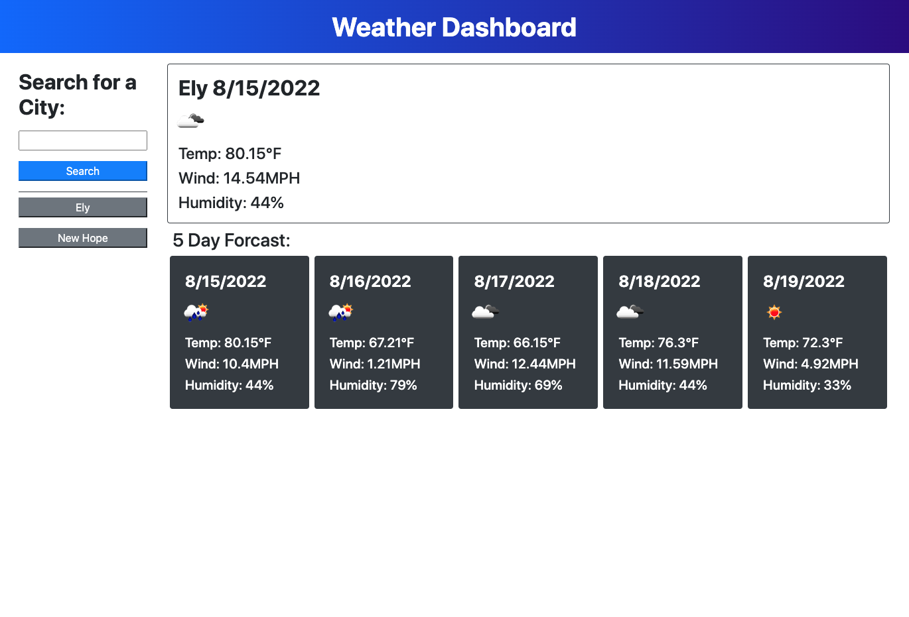

# 06-Weather-Dashboard

## Nice day we're having!

This weather dasboard functions as follows:

```
1. Upon load the user is presented with a weather dashboard
2. The user can search based off of city name
3. The search results in current forcast along with the next five days
4. The results contain the city name, date, weather icon, temp, humidity , and wind speed.
5. UV Index not included as the feature has been removed from the API
6. Search history is populated based off of users past searches and is present after reloading the page
```

## Mock-up



## Links

Github repository link: https://github.com/BryanBorek/06-Weather-Dashboard

Link to deployed site: 